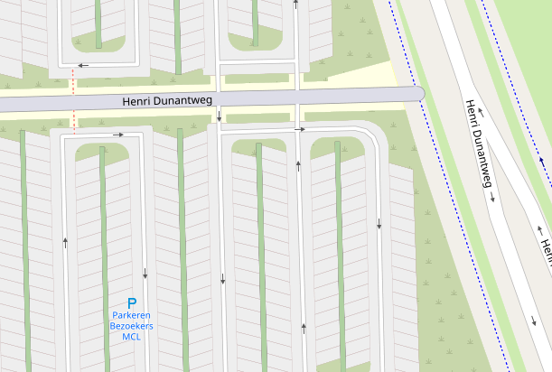
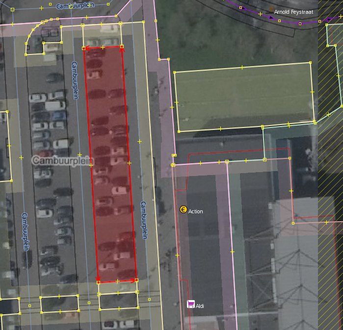
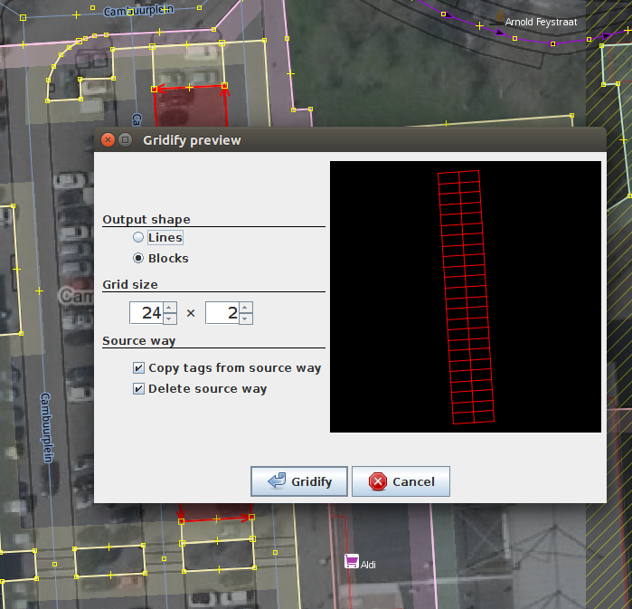
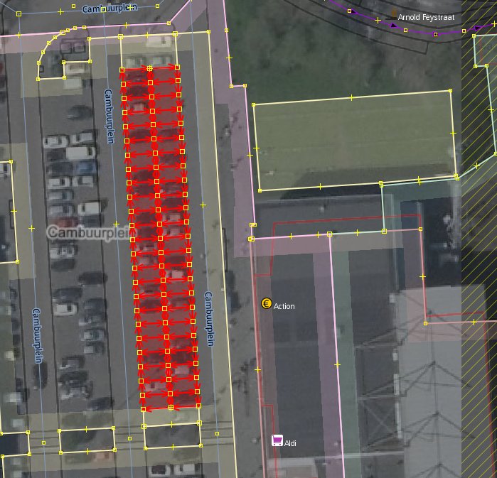

Gridify
=======

This JOSM plugin gives allows you to generate a grid of ways (either as blocks or as lines) from any four nodes, or way of four nodes. This is particularly useful for drawing repeating blocks such as [parking spaces](https://wiki.openstreetmap.org/wiki/Tag:amenity%3Dparking_space):

## Usage

To use, select a way containing four nodes (the way may be closed or open), or four separate nodes. The plugin can copy the tags on the source way to the newly generated ways, so if you want to repeat the same set of tags, you can add them to the source primitive.

The source way does not have to be rectangular, by the way. Using a parallelogram instead can be handy for a set of slanted parking spaces like those in the picture above.

Now launch the plugin. You can find the plugin in the menu under `More tools » Gridify` or by using the shortcut `Alt+Shift+Y`.

### Output shape

You can generate either blocks or lines. The default is blocks.

### Grid size

Configure the grid to your liking, by entering the number of rows and columns.

You can also use the scrollwheel by moving your mouse pointer over the preview area. To increase/decrease only rows or columns, scroll by holding down `shift` or `ctrl`, respectively. Give it a go: if you use this plugin often this is a fast method of setting it up.

### Source way

Choose if you want to copy all tags from the source way or not, and if the source way should be deleted. If you drew the source way specifically to split it up using this plugin, this is usually what you want.

Now execute the plugin.

Done!
